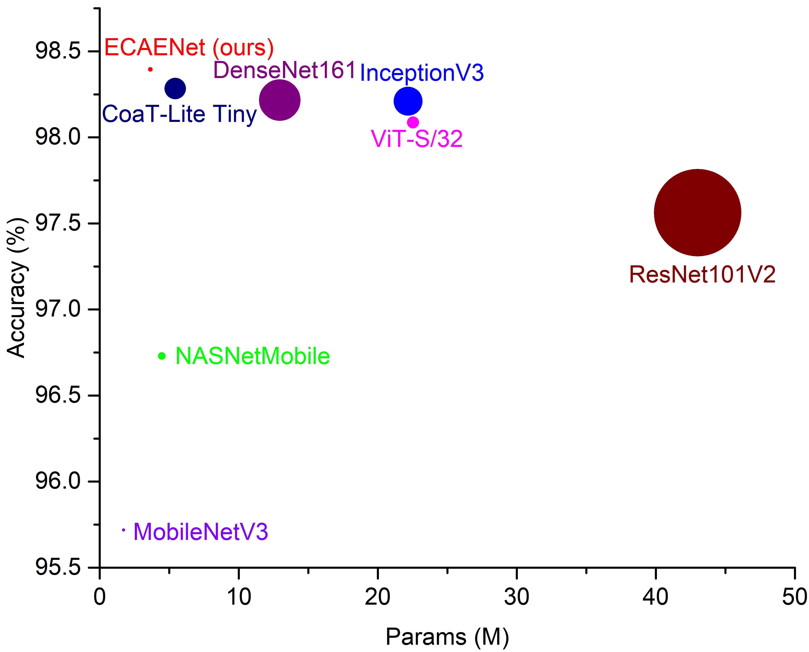
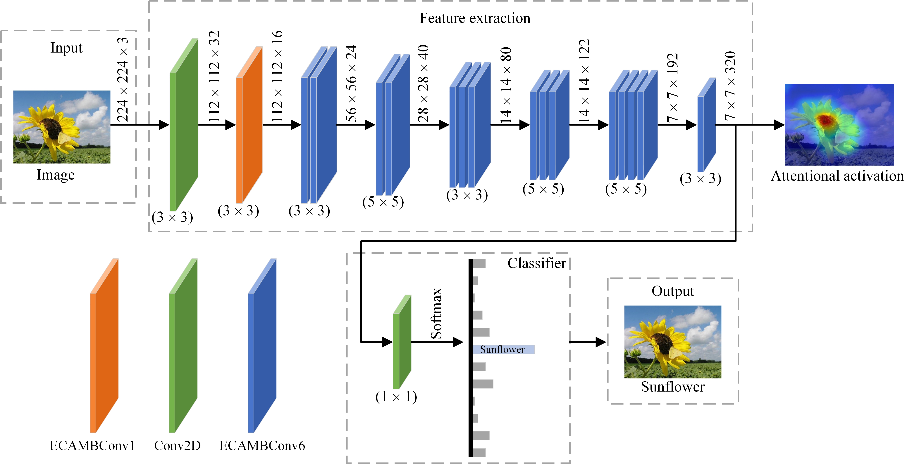

# ECAENet  (TensorFlow and Keras)

ECAENet: EfficientNet with Efficient Channel Attention for Plant Species Recognition 

(SCI:Q3) (Journal of Intelligent & Fuzzy Systems)

## Results


## ECAENet Architecture


## Requirements

```bash
pip install pillow

pip install matplotlib

pip install scikit-learn

pip install tensorflow-addons

pip install tensorflow-gpu

conda install cudnn
```
## Start Up
You can run the train.py to train or evaluate as follow:
``` python
python train.py 
python train.py --epoch 100 --lr 5e-5 --data flower --af swish --at eca --batch_size 32 --img_size 224
```

## Contact Information
If you have any suggestion or question, you can leave a message here or contact us directly: guangjinzheng@qq.com. Thanks for your attention!
